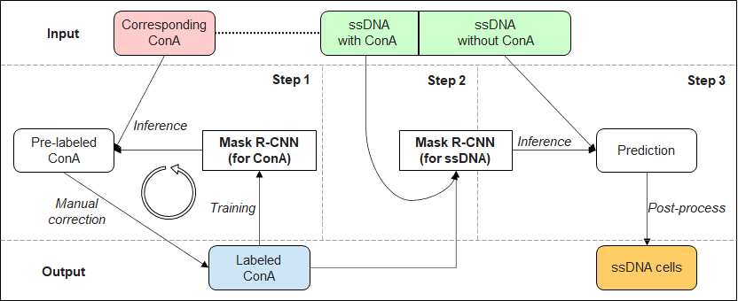

# Cell Segmentation for Fluorescence Images

[](https://www.python.org/) 

This repository provides a cell segmentation method for ssDNA images with ConA images assisted, which is implemented based on mmdetection. The method is mainly consisted of two parts, annotate cells on ConA images with an active learning procedure and train ssDNA image cell segmentation model with labels transferred from ConA images.



# Dependences

[](https://github.com/numpy/numpy)
[](https://github.com/cocodataset/cocoapi)
[](https://github.com/pytorch/pytorch)
[](https://github.com/open-mmlab/mmcv/)


# Usage

## Data preparation
Run codes in dataset_generation/ to crop images into patches and generate COCO format json files.
```
python dataset_generation/conA/crop.py
python dataset_generation/conA/generate_coco_annotation.py.py
python dataset_generation/ssDNA/crop.py
python dataset_generation/ssDNA/generate_coco_annotation.py.py
```

## ConA model training and validation
The configuration file for training and validating a ConA model is in local_configs/conA_human_in_loop/, run the following code to train a ConA model.
```
bash tools/dist_train.sh local_configs/conA_human_in_loop/mask_rcnn_baseline.py 2
```

## ssDNA model training and validation
The configuration file for training and validating an ssDNA model is in local_configs/ssDNA_with_incomplete_annotations/, run the following code to train an ssDNA model.
```
bash tools/dist_train.sh local_configs/ssDNA_with_incomplete_annotations/mask_rcnn_baseline.py 2
```

# Disclaimer

This tool is for research purpose and not approved for clinical use.

This is not an official Tencent product.

# Coypright

This tool is developed in Tencent AI Lab.

The copyright holder for this project is Tencent AI Lab.

All rights reserved.
